#  Chat Broadcast 

## Client 1
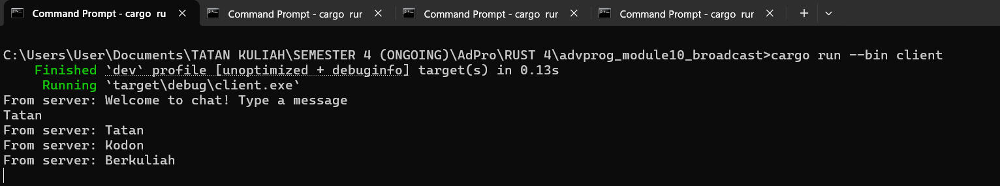

## Client 2
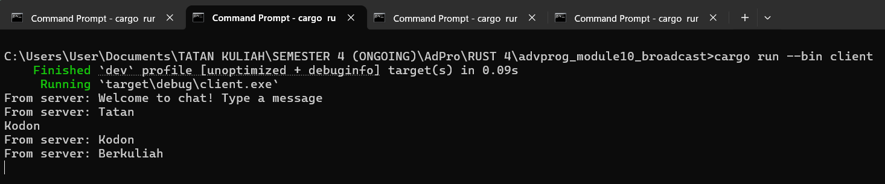

## Client 3
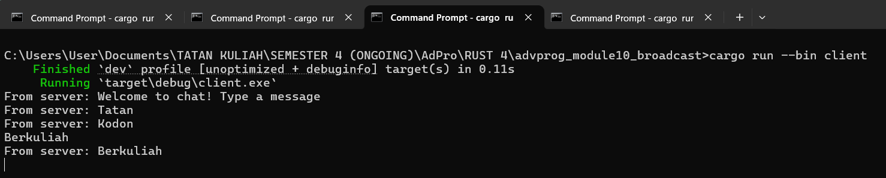

## Server 
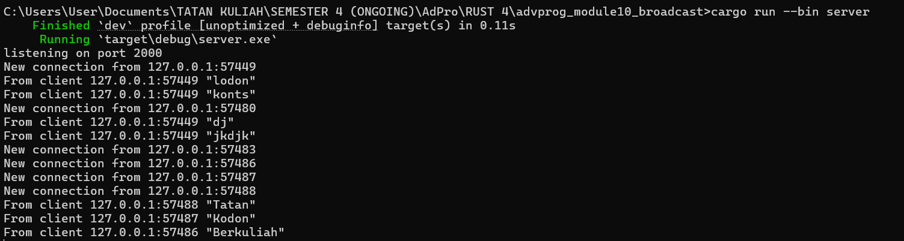

Pada dasarnya, server berperan sebagai pusat komunikasi yang selalu siaga memantau setiap koneksi dari para klien. Ketika sebuah klien mengirimkan pesan, server menangkap pesan tersebut melalui jalur koneksi yang sudah terbuka sebelumnya. Karena server menyimpan daftar lengkap seluruh klien yang sedang terhubung, ia tahu persis ke mana saja pesan perlu dikirimkan.

Setelah pesan diterima, server segera memprosesnya dan kemudian mendistribusikannya kembali ke semua klien yang ada pada daftar itu, termasuk si pengirim. Proses pengiriman ulang ini berlangsung sangat cepat sehingga setiap peserta percakapan seolah menerima pesan secara serempak. Dengan cara inilah konsistensi percakapan terjaga: semua orang, tanpa kecuali, mendapatkan informasi yang sama pada waktu hampir bersamaan.

Mekanisme tersebut juga memungkinkan sinkronisasi tampilan pesan di masing-masing perangkat. Klien tidak perlu bertanya lagi ke server apakah pesan yang baru dikirim sudah diterima pengguna lain, karena server sendirilah yang memastikan propagasi pesan terjadi. Alhasil, percakapan tetap lancar, real-time, dan terasa natural bagi semua pengguna.

## Port Changes

### Only Client
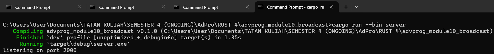
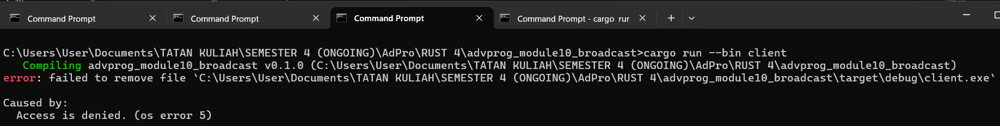

### Both Client and Server
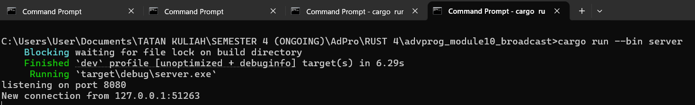
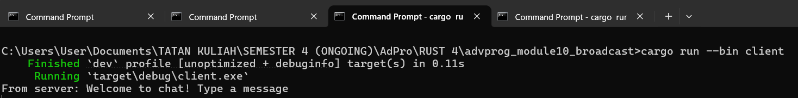

Pada saat saya mengubah port pada sisi klien menjadi 8080, klien otomatis mencoba terhubung ke WebSocket di port 8080. Sementara itu, server masih menunggu koneksi di port 2000, karena port-nya belum saya ubah. Karena tak ada layanan WebSocket di port 8080, klien terus-terusan gagal membangun koneksi dan muncul error “ConnectionRefused”. Upaya reconnect berulang kali tak pernah berhasil. Setelah saya sesuaikan port server menjadi 8080 juga, kedua belah pihak akhirnya “berbicara” di jalur yang sama. Klien dan server kini terkoneksi pada port yang identik, sehingga aplikasi kembali berjalan lancar seperti semula.

## Small Changes for information to user

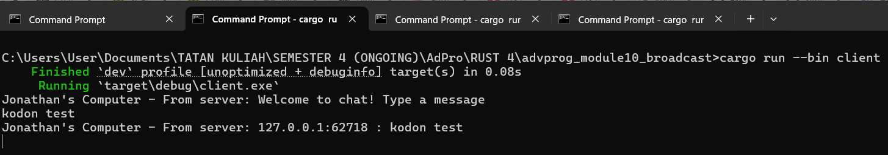
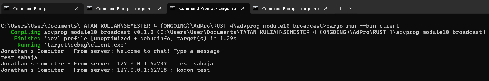
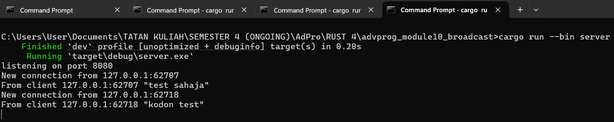

Pada tahap ini, kita menambahkan informasi pengirim untuk setiap klien, yakni alamat IP dan nomor port mereka. Dengan begitu, klien bisa mengetahui siapa yang mengirim pesan. Untuk menerapkannya, kita perlu mengubah format pemanggilan bcast_tx.send di berkas server.rs.